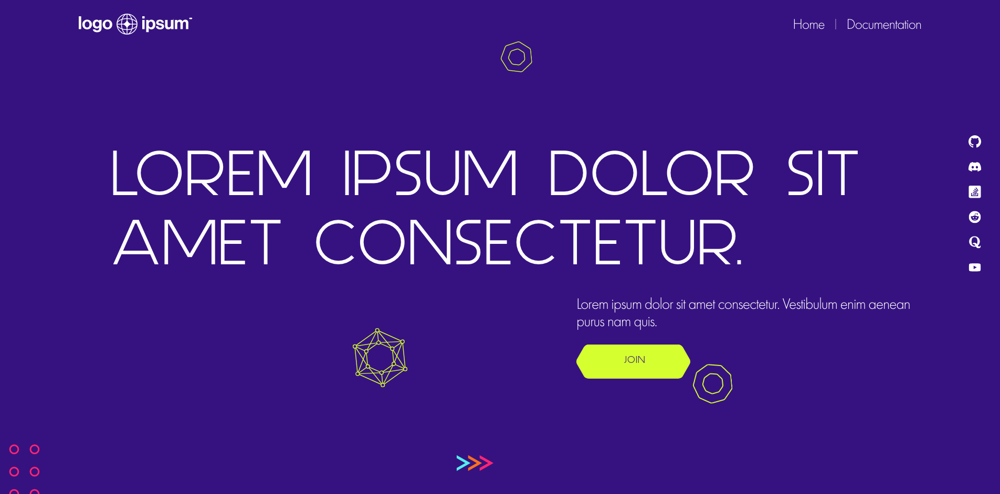

# PopArt Studio Assessment Test

**This project is an assessment test for a company [PopArt Studio](www.popwebdesign.net/index_eng.html) for a position Front-end Developer - Internship.**

## Table of contents

- [Overview](#overview)
    - [The challenge](#the-challenge)
    - [Screenshot](#screenshot)
    - [Links](#links)
- [My process](#my-process)
    - [Built with](#built-with)
    - [What I learned](#what-i-learned)
    - [Useful resources](#useful-resources)
- [Author](#author)

**Note: Delete this note and update the table of contents based on what sections you keep.**

## Overview

### The challenge

- Build out the project to the [Figma](https://www.figma.com/file/solUWFssRSNLbkjXrygkwi/Dev-test?node-id=0-1) designs provided.
- Webpage needs to be responsive as well
- Using HTML5, CSS, BEM, JavaScript as needed

### Screenshot

### Links

- GitHub URL: [https://github.com/letStayFoolish/popart-internship](https://github.com/letStayFoolish/popart-internship)
- Live Site URL: [Vercel]()

## My process

### Built with

- Semantic HTML5 markup
- CSS custom properties
- Flexbox
- CSS Grid
- BEM
- Desktop-first workflow
- JavaScript (ES6 - Basic)

### What I learned

While working on this landing webpage using only HTML and CSS3 with the BEM (Block Element Modifier) methodology, I gained valuable insights and experiences that enhanced my understanding of web development and best practices. Here are some key takeaways from the project:

1. Modular Structure with BEM: Implementing the BEM methodology helped me create a clear and organized structure for my HTML and CSS code. Breaking down components into blocks, elements, and modifiers made the codebase more maintainable and easier to work with.

2. Component Reusability: By designing components as self-contained entities, I found that I could easily reuse them throughout the webpage. This not only saved development time but also ensured consistency in styling and behavior.

3. Naming Conventions: Using BEM naming conventions consistently improved code readability and made it easier to understand the relationships between different parts of the webpage. This naming approach also helped prevent naming conflicts and made collaboration with team members smoother.

4. CSS Flexbox/Grid for Layout: I discovered the power of CSS Flexbox and Grid for creating responsive and flexible layouts. Leveraging these layout techniques allowed me to achieve a visually appealing and consistent design across various screen sizes.

5. Responsive Design: Through hands-on experience, I learned how to use media queries effectively to create a responsive design that adapts seamlessly to different devices and viewport sizes.

6. CSS Styling Techniques: Working on this project exposed me to various CSS styling techniques, such as transitions, transforms, and pseudo-elements, that helped enhance the visual appeal and interactivity of the webpage.

### Useful resources

- [MDN Web Docs - CSS Grid Layout](https://developer.mozilla.org/en-US/docs/Web/CSS/CSS_Grid_Layout): The MDN Web Docs provide comprehensive and authoritative documentation on CSS Grid, including guides, tutorials, and examples.
- [CSS-Tricks Guide to Grid](https://css-tricks.com/snippets/css/complete-guide-grid/): CSS-Tricks is a popular web development blog that offers an in-depth guide to understanding and using CSS Grid.
- [Flexbox vs. Grid](https://css-tricks.com/snippets/css/a-guide-to-flexbox/): Understanding when to use Flexbox and when to use Grid is crucial. This guide explains the differences between the two and when to use each.

## Author

- Website - [Karaklajic Nemanja / Chili](https://chilicode.netlify.app/)
- LinkedIn - [Karaklajic Nemanja](https://www.linkedin.com/in/nemanjakaraklajic30111990/)
- GitHub - [letStayFoolish](https://github.com/letStayFoolish)

[//]: # (## Acknowledgments)

[//]: # ()
[//]: # (I would like to express my gratitude to the following individuals and resources that have contributed to the development of this front-end project:)

[//]: # ()
[//]: # ([Name]: [Brief description of their contribution or assistance])

[//]: # ([Name]: [Brief description of their contribution or assistance])

[//]: # (I would also like to acknowledge the following open-source libraries, frameworks, and resources that were instrumental in creating this project:)

[//]: # ()
[//]: # (Library/Framework/Resource Name: Brief description of how this was used in the project.)

[//]: # (Library/Framework/Resource Name: Brief description of how this was used in the project.)

[//]: # (Lastly, I want to thank my friends and family for their support and encouragement throughout the development of this project.)
